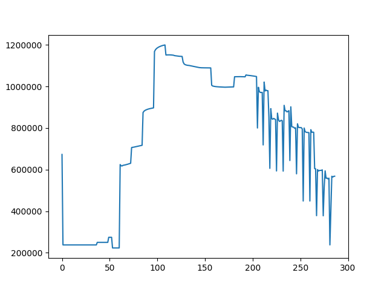

**********
Quickstart
**********

Before you run any examples, make sure you have all the requirements installed.

pyEp
====
*Note: This tutorial assumes you have installed EnergyPlus 8.1*

*Note: This tutorial requires matplotlib to display the results graphically*

First navigate to the pyEp installation directory. If you installed with pip, it should be under ``/PythonXX/Lib/site-packages/pyEp``. Open example.py with your editor of choice. After the import statements, the first line should be:

.. code-block:: Python

    pyEp.set_eplus_dir("C:\\EnergyPlusV8-1-0")

On Windows, this is the default installation directory. Change the directory to the EnergyPlus installation directory if you are using Linux or MacOS. ``set_eplus_dir()`` gives pyEp the default EnergyPlus directory, which will be used to create EnergyPlus instances.

Next, move the .epw file from the installation directory and into the WeatherData directory inside the EnergyPlus installation directory. On Windows, this is ``C:\EnergyPlusV8-1-0\WeatherData``. The .epw file contains the weather data that EnergyPlus needs to run a simulation.

Run example.py, from the pyEp installation directory. On the command line output, you should see pyEp connecting to an EnergyPlus process, and beginning the cosimulation. After a few seconds, the simulation will finish. At the end of the simulation, and you will be able to see the power consumption path for a full EnergyPlus day. It should look like this.

